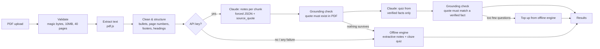

# Groundwork

**Turn a lecture PDF into revision notes and a practice quiz you can trust. Every answer links back to the sentence in your own lecture that supports it.**

> Vertical: **AI-Powered Student Workspace** (AI Productivity & Automation)
> Flow: **Lecture PDF → condensed revision notes + practice quiz from the same content**

---

## The problem

Before an exam, a student with a 30-slide lecture deck usually:

1. re-reads everything,
2. copies the important sentences into notes,
3. writes their own practice questions, then
4. checks their answers against the slides.

That's an hour or more of copying before they've studied anything. AI summarizers speed this up, but they add a new problem: **you can't tell which parts the model made up.** A student can't revise from notes they have to fact-check line by line.

## What Groundwork does

Upload a lecture PDF and get, in a few seconds:

- **TL;DR**: the 3 most important sentences in the lecture
- **Section-by-section notes** that follow the lecture's own headings
- **Key terms**: the concepts the lecture keeps coming back to ("electron transport chain", "NADH"), not generic words
- **A 4–6 question practice quiz** with instant scoring
- **"Show source" on every note and quiz answer**, which reveals the exact sentence from the PDF behind it
- **Export**: notes as Markdown, and the quiz as an Anki-importable CSV

**The key moment:** after checking your answers, click *Show source* on any question. You'll see the exact sentence from your lecture that the question came from, so you can check it yourself.

## Quick start

Requires **Node.js 22.13+**.

```bash
cd backend
npm install
npm start
```

Open http://localhost:3000 and click **"No PDF handy? Try a sample lecture"**, or upload your own text-based PDF.

**Optional: enable Claude.** Copy `backend/.env.example` to `backend/.env` and set `ANTHROPIC_API_KEY`. Without a key the app runs fully offline (see [Two engines](#two-engines-one-contract)).

```bash
npm test   # 32 tests, no network or API key needed
```

---

## How it works



### 1. Validation (`lib/pdfExtractor.js`, `server.js`)
- The file's real **magic bytes** (`%PDF-`) are checked. The browser's MIME type and file extension are only used for a quick early rejection, since both can be spoofed.
- Uploads stay **in memory only** and are never written to disk. Limits: 10 MB, one file, first 40 pages.
- Scanned (image-only), corrupted and password-protected PDFs return a clear message explaining what went wrong.

### 2. Cleaning and structure (`lib/summarizer.js`, `lib/notesBuilder.js`)
PDF text from real lecture slides is messy. Before any AI step, Groundwork:
- strips bullet glyphs (`•`, `▪`, Wingdings, the "o " outline bullet) and treats each bullet as its own point
- drops page numbers and keeps only the first copy of a line repeated on every slide (running footers, repeated slide titles)
- tells headings apart from wrapped lines: a short line with no final punctuation that doesn't end on a word like "the" is a heading
- splits the lecture into sections at those headings

### 3. AI pipeline, when a key is configured (`lib/pipeline.js`, `lib/prompts.js`)
The whole document is **not** sent to the model in one call with its answer shown as-is.

| Step | What happens | Why |
|---|---|---|
| **Chunk** | Sections are grouped into ≤6,000-character chunks at section boundaries (max 4 chunks), processed in parallel | Each call gets coherent content, and a long lecture doesn't mean one giant slow request |
| **Extract notes** | Claude returns `{sections, glossary}` through a **forced tool call** (JSON schema). Every bullet and definition must include a `source_quote` copied word-for-word from the chunk. The prompt forbids outside knowledge. | The output is predictable data, not free text we'd have to parse |
| **Verify notes** | Code checks that each `source_quote` really appears in the PDF text (case- and whitespace-insensitive). Anything that fails is dropped. | Hallucination check done in code. The model never grades its own output. |
| **Generate quiz** | Claude sees **only the verified facts** and must set each question's `source_quote` to one of those facts' quotes | Questions can only test material that has already been confirmed |
| **Verify quiz** | Code checks each quote against the verified facts, plus exactly 4 choices and a valid answer index | Malformed or unsupported questions never reach the student |
| **Fallback** | Any API error, timeout (20s), schema failure or empty result → offline engine. Too few surviving questions → topped up offline. | The student always gets a usable result |

The TL;DR is always extractive: the top-ranked sentences, quoted exactly. It's accurate by construction and costs no API call.

### 4. Offline engine (`lib/summarizer.js`, `lib/quizGenerator.js`)
- **Notes:** sentences are ranked by content-word frequency, normalized by length. The top sentences in each section are kept, in their original order.
- **Key terms:** multi-word phrases that **repeat** in the lecture, acronyms that appear at least twice (roman numerals excluded), and frequent content words. Stopwords and generic lecture vocabulary ("process", "stage", "slide") are filtered out. Terms keep the lecture's own capitalization (`ATP`, not `atp`).
- **Quiz:** fill-in-the-blank questions built from the highest-ranked sentences. The most specific key term in the sentence is blanked, and the distractors are other key terms from the same lecture. A seeded random generator keeps the output reproducible.

### Two engines, one contract
Both engines return the same shape, so the frontend doesn't need to know which one ran:

```js
{
  notes: { tldr: string[], sections: [{ title, bullets: [{ text, sourceQuote }] }],
           glossary: [{ term, definition, sourceQuote }] },
  quiz:  [{ id, question, choices: string[4], correctIndex, sourceQuote, grounded }],
  meta:  { usedLlm, subject, warnings, notices, pageCount }
}
```

### Light personalisation (`lib/subjects.js`)
Picking a subject (General, STEM, Humanities, Language) sets how many key terms and quiz questions you get. It also goes into the Claude prompt so extraction focuses on the vocabulary that subject uses. Unknown values fall back to General.

---

## Security

| Risk | Mitigation |
|---|---|
| Spoofed file type | Magic-byte check is the deciding check. MIME type and extension are only an early filter. |
| Malicious PDF | pdf.js runs with `isEvalSupported: false` (the attack path in CVE-2024-4367), with font-face loading and system fonts disabled |
| Data leaking between users | Every upload opens its own pdf.js document, which is destroyed afterwards. A regression test checks that one document's text can never appear in the next result (the previous library, `pdf-parse` 1.1.1, failed this and was replaced). |
| Disk / path traversal | Memory storage only. Nothing is ever written to disk. |
| Resource exhaustion | 10 MB limit, 1 file, 40-page cap, 20s LLM timeout, 10 requests/min per IP on the processing route |
| XSS from PDF content | The frontend never uses `innerHTML`. All content goes in through `textContent`. Strict CSP: `default-src 'self'`, `object-src 'none'`, `frame-ancestors 'none'` |
| CSV formula injection | Exported cells starting with `= + - @` are prefixed so spreadsheet apps don't run them as formulas |
| Secrets | API key comes from the environment or `.env` (gitignored) and is never sent to the browser |
| Error leakage | Central error handler returns safe messages and never sends stack traces to the client |

**Known advisory:** `npm audit` reports a moderate issue in `qs`, which Express 4 uses internally. It affects parsing of deeply nested query strings. This app only receives a multipart upload and one form field, so the risk is low here.

## Accessibility

- Semantic structure: skip link, landmarks, one `h1`, labelled sections
- Quiz questions use `fieldset`/`legend` with native radio buttons, so arrow keys work within each question
- Tabs follow the WAI-ARIA pattern (`role="tab"`, `aria-selected`, arrow-key switching, roving `tabindex`)
- `aria-live` announcements for processing, errors and quiz score. Focus moves to the new heading when the screen changes.
- "Show source" buttons use `aria-expanded` / `aria-controls`
- Visible `:focus-visible` outlines, light and dark themes, 44px+ touch targets, no horizontal scrolling at 375px

## Testing

`npm test` runs **32 tests** with no network and no API key:

- **Grounding:** made-up quotes are rejected, too-short quotes are rejected, unsupported bullets are removed while supported ones stay, malformed quiz items are rejected
- **PDF handling:** real extraction, the same result on repeated runs, **no data leaking between documents**, spoofed and corrupted files, scanned (text-less) PDFs
- **Messy slides:** bullet glyphs, page numbers, running footers, repeated titles, wrapped lines
- **Quiz:** reproducible output, 4 unique choices, every question traceable to the source, no questions built from headings
- **Key terms:** one-off word sequences aren't promoted to terms, acronyms keep their capitalization
- **Pipeline:** chunking, merging, duplicate removal, full offline fallback

Tested by hand against the running server: valid upload, no file, wrong MIME type, spoofed PDF, 11 MB file, scanned PDF, corrupted PDF, 12-page document, malicious `subject` value, rate limiting, and the full UI flow on desktop and a 375px mobile viewport.

## Assumptions

- Input is a **text-based** PDF. Scanned slides need OCR, which isn't included.
- Lectures are in **English**. Stopwords and sentence splitting assume English.
- The key is optional: judges and students without an Anthropic key still get a working product.
- One user session at a time per request. Nothing is stored between requests (no accounts or history).
- The rate limiter is in-memory, which is fine for a single instance. A multi-instance deployment would need a shared store.

## Limitations

- **Offline quality depends on repetition.** Phrases count as key terms only if the lecture repeats them, so a very short lecture gives a thin glossary.
- **Offline quiz questions are fill-in-the-blank.** Conceptual "why" questions need the Claude path.
- **The Claude path has unit tests but wasn't exercised against the live API** in this build (no key was available). Its grounding filters and fallbacks are tested. Output quality with a real key hasn't been measured.
- The processing steps shown on screen follow the request's real timing but are not streamed from the server.
- Only the first 40 pages are processed. Longer documents show a notice.

## Future improvements

- DOCX / PPTX input (the extractor is isolated, so this means adding a new format parser)
- OCR for scanned slides
- Stream real pipeline progress over Server-Sent Events
- A second quiz round that targets the questions the student got wrong

## Project structure

```
backend/
  server.js               routes, upload limits, security headers, error mapping
  lib/pdfExtractor.js     validation + isolated pdf.js text extraction
  lib/summarizer.js       cleaning, sentence ranking, key-term extraction
  lib/notesBuilder.js     section detection + offline notes
  lib/quizGenerator.js    offline fill-in-the-blank quiz (seeded)
  lib/prompts.js          Claude prompts + JSON schemas
  lib/llmClient.js        forced tool-use wrapper with timeout
  lib/grounding.js        deterministic source verification
  lib/pipeline.js         orchestration, chunking, fallbacks
  lib/subjects.js         subject presets
  middleware/rateLimit.js
  scripts/make-sample-pdfs.js
  test/nlp.test.js
frontend/                 index.html, app.js, style.css (no build step)
samples/                  sample-lecture.pdf, large-lecture.pdf, blank-scan.pdf
```

## License

MIT
